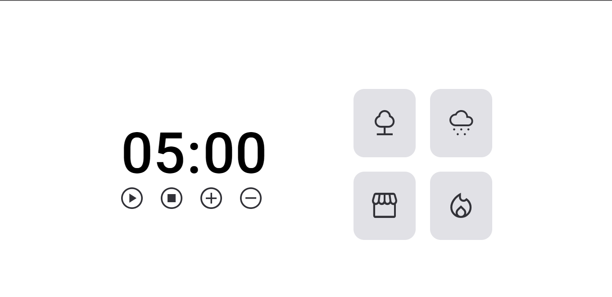
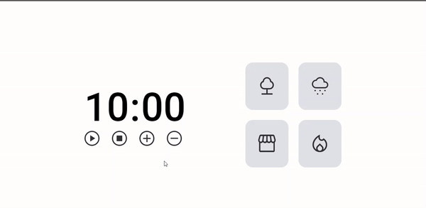

# <h1 align="center">Timer Focus 2.0</h1>

 Challenge 01 - Stage 03 - RocketSeat Explorer.

 <a href="#-Worked-concepts">Worked Concepts</a>&nbsp;&nbsp;&nbsp;|&nbsp;&nbsp;&nbsp;
  <a href="#-Features">Features</a>&nbsp;&nbsp;&nbsp;|&nbsp;&nbsp;&nbsp;
  <a href="#-Technologies">Technologies</a>&nbsp;&nbsp;&nbsp;|&nbsp;&nbsp;&nbsp;
  <a href="#-Project">Project</a>&nbsp;&nbsp;&nbsp;|&nbsp;&nbsp;&nbsp;
  <a href="#-License">License</a>

  

## 📝 Worked Concepts

- Callback functions
- Recursion
- Clean Code
- ES6 modules
- Factory Method
- Dependency injection
- Refactoring

## ✔ Features

- Play/pause button
- Stop button
- Set time option
- Sound button

## 🚀 Technologies

- HTML e CSS
- JavaScript
- Git e Github
- Figma

## 💻 Project

  

## 📝 License

  

 

